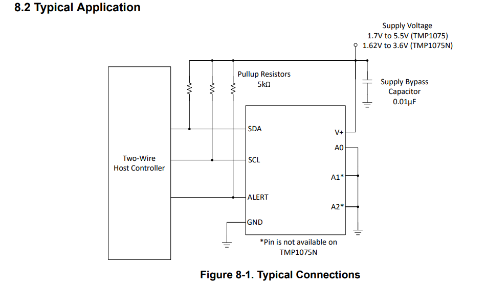
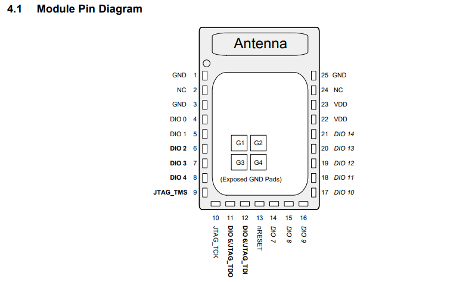
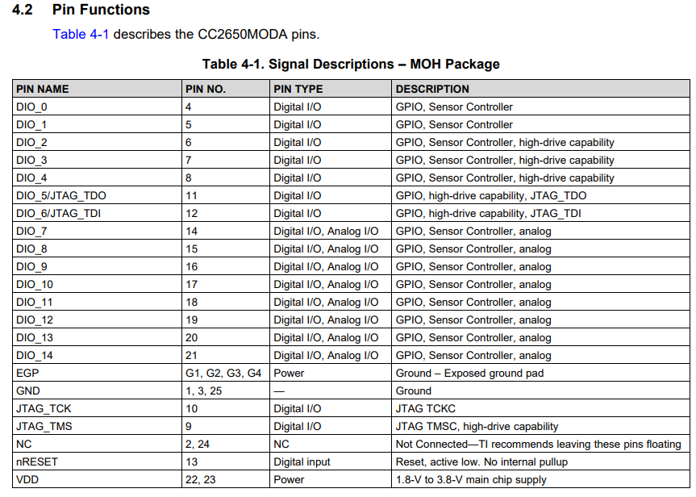
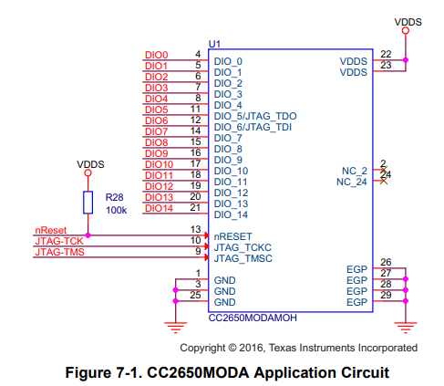
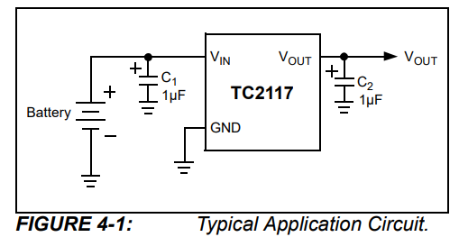
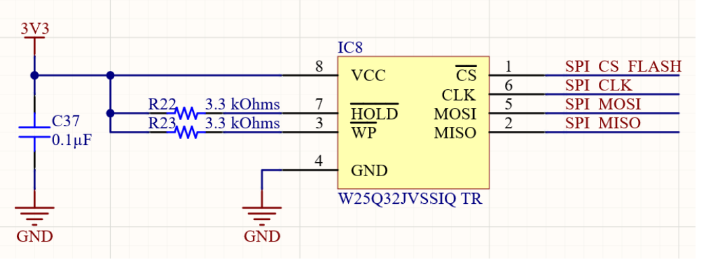

## 📚 References

### 🌡️ Temperature Sensor — TMP1075
- Datasheet: https://www.ti.com/lit/ds/symlink/tmp1075.pdf

#### Typical Application

---

### 📡 MCU + BLE Transmission — CC2650MODA
- Datasheet: https://www.ti.com/lit/ds/symlink/cc2650moda.pdf

#### Module Pin Diagram

#### Pin Functions

#### Application Circuit

---

### 🔌 Voltage Regulator — TC2117
- Datasheet: https://www.microchip.com/downloads/aemDocuments/documents/APID/ProductDocuments/DataSheets/21665d.pdf

#### Typical Application Circuit

---

### 💾 External Flash — W25Q32JVSSIQ
- Reference: https://resources.altium.com/p/gnss-lte-asset-tracker-project-part-1

#### Circuit Diagram

---
